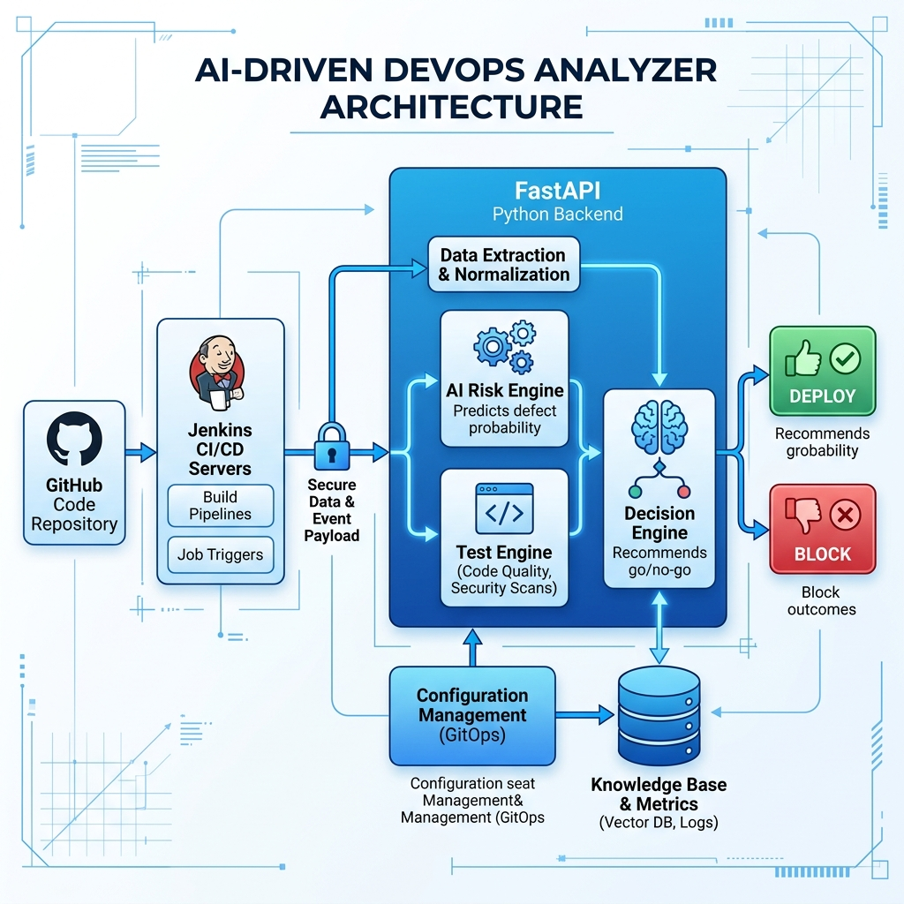

# System Architecture and Project Workflow

This document contains the architecture diagram illustrating the original planned workflow (using real Machine Learning and CI/CD integrations) as well as the precise technical script detailing the data flow of the currently built prototype.

## 1. Original Planned Architecture Diagram (True ML Pipeline)

This represents what the system architecture would look like in a real-world, fully integrated production environment.



```mermaid
graph TD
    %% Entities
    DEV[Developer] -->|Git Push / PR| GITHUB[GitHub Repository]
    GITHUB -->|Webhook Trigger| CI_SERVER[CI/CD pipeline <br/> GitHub Actions / Jenkins]

    %% AI DevOps Analyzer System
    subgraph AI DevOps Analyzer
        API_GATEWAY[FastAPI Gateway]
        FEATURE_EXTRACTOR[Data Extractor <br/> Fetches Commit Diff, Churn, Complexity]
        ML_MODEL[Scikit-Learn ML Model <br/> Trained on Historical Deployment Data]
        TEST_ENGINE[Dynamic Test Strategy Engine]
        DECISION[Deployment Decision Engine]
        
        API_GATEWAY -->|Req: Repo URL, Branch| FEATURE_EXTRACTOR
        FEATURE_EXTRACTOR -->|Outputs: Float Tensors / Feature Vectors| ML_MODEL
        ML_MODEL -->|Outputs: Exact Failure Probability %| TEST_ENGINE
        TEST_ENGINE -->|Outputs: Recommended CI Jobs to Run| DECISION
    end

    %% Flow
    CI_SERVER -->|API Call: Analyze Risk| API_GATEWAY
    DECISION -->|Response: Webhook / API Reply| CI_SERVER
    
    %% Outcomes
    CI_SERVER -->|If DEPLOY| PROD[Production Environment]
    CI_SERVER -->|If BLOCK| ALERT[Slack / Email Alert to DevOps]
    
    classDef sys fill:#1f2937,stroke:#3b82f6,stroke-width:2px,color:#fff;
    class AI DevOps Analyzer sys;
```

---

## 2. Technical Presentation Script: Current Project Workflow

*You can use this script during your viva or presentation to technically defend exactly how data moves through your current Prototype's backend, phase by phase.*

**"Our project currently implements a highly deterministic, API-driven simulation of an AI DevOps Analyzer, built using FastAPI. The architecture is broken into a 5-phase data pipeline where the output of one engine serves as the exact state input for the next."**

### **Phase 1: Data Ingestion & Validation (FastAPI Layer)**
* **Input:** The React frontend compiles user inputs into a JSON payload and issues an HTTP POST request to the `/analyze` endpoint.
* **Payload Structure:** 
  ```json
  {
    "requirement": "Add Stripe payment gateway for user subscriptions",
    "repo_url": "https://github.com/myorg/backend",
    "branch": "feature/stripe-integration"
  }
  ```
* **Process:** FastAPI uses Pydantic specifically to validate these boundaries: it ensures the requirement is between 10 and 2000 characters, runs a regex check ensuring the repo url begins with `http` or `https`, and ensures the branch name is not a null object.
* **Output:** Validated Python strings passed internally to our Risk Engine.

### **Phase 2: Risk Scoring (The `risk_engine.py`)**
* **Input:** `(requirement: str, repo_url: str, branch: str)`
* **Process:** This engine mimics a Machine Learning feature-weighting system using static algorithmic parsing. 
  1. It tokenizes the `requirement` string and checks it against two static dictionaries mapping keywords to float values (e.g., `"payment": 0.40`). 
  2. The system checks branch mapping; for example, if the branch is `main` it adds `0.15` to the risk, while `hotfix` adds `0.25`. 
  3. It sums these weights and bounds the final score between `0.0` and `1.0`.
  4. It categorizes the float: `< 0.30` is Low, `< 0.70` is Medium, and `>= 0.70` is High.
* **Output Dictionary generated:** 
  ```python
  {
    "risk_score": 0.65, 
    "risk_level": "Medium", 
    "confidence": 0.35, 
    "triggered_keywords": ["payment", "stripe"]
  }
  ```

### **Phase 3: Test Simulation Pipeline (The `test_engine.py`)**
* **Input:** `risk_level` (String) and `risk_score` (Float) from Phase 2.
* **Process:** 
  1. **Test Strategy:** It evaluates the `risk_level` and strictly maps it to a test tier. "Low" maps to Unit Tests, "Medium" to Integration Tests, and "High" to Regression Tests.
  2. **Execution Simulation:** It utilizes the `risk_score` float to calculate the probability of the simulated test suite failing. Mathematically, it takes a baseline pass probability (e.g., 0.70 for an Integration test) and subtracts `(risk_score * 0.20)`. 
  3. It then invokes Python's `random` package alongside this probability boundary to decide the `test_result` (PASS or FAIL), while artificially generating associated CI metrics (Code Coverage % and Total Tests Run vs Passed).
* **Output Dictionary generated:**
  ```python
  {
    "test_result": "PASS", 
    "pass_rate": 0.91, 
    "coverage": 0.84, 
    "tests_run": 78,
    "tests_passed": 70,
    "tests_failed": 8
  }
  ```

### **Phase 4: Deployment Decision (The `decision_engine.py`)**
* **Input:** `test_result` (String from Phase 3) and `risk_level` (String from Phase 2).
* **Process:** This acts as the final boolean logic gate representing a CI/CD pipeline blocker. 
  * If the test returns `PASS`, the action is automatically `DEPLOY`. 
  * If the test returns `FAIL`, it checks the context: if the original risk was `Low`, it allows a `RETRY` (simulating a flaky pipeline). If the risk was Medium or High, the gate triggers a hard `BLOCK`.
* **Output:** A strict Action String: `"DEPLOY"`, `"BLOCK"`, or `"RETRY"`.

### **Phase 5: Aggregation & Final JSON Delivery**
* **Input:** The dictionary outputs aggregated from Phases 2, 3, and 4.
* **Process:** `main.py` stitches these segmented returns into a cohesive JSON response object. 
* **Final Output:** The API sends an HTTP 200 OK containing all variables, allowing the React frontend to dynamically render the final dashboard views, test progress bars, and the end deployment decision.
